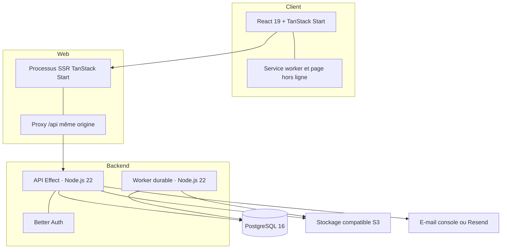
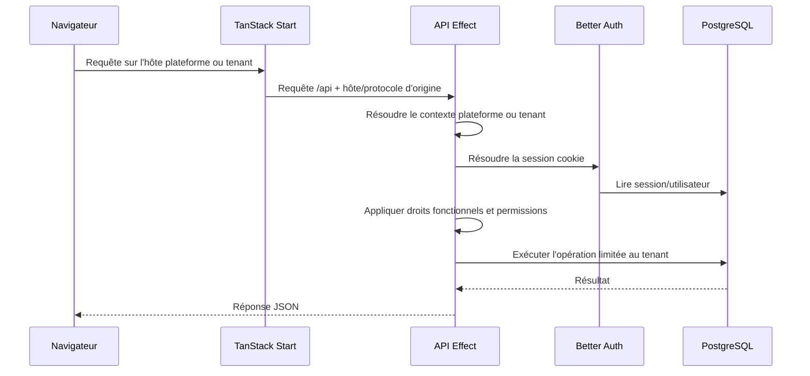
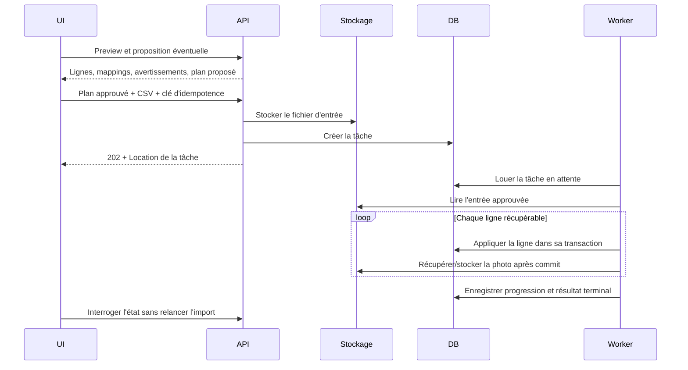
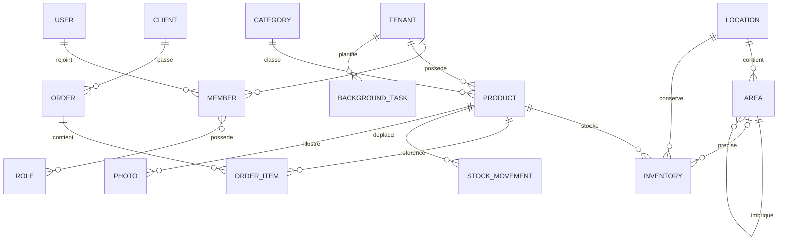

# Architecture

Stocket sépare des dépôts publiés indépendamment d'un workspace local
coordonné. L'application est un système web/API multi-tenant complété par un
worker de tâches durables.

Pour l'inventaire exhaustif des dépôts et fonctionnalités, consultez la
[carte des projets et modules](project-map.md).

## Vue d'ensemble



Le service worker précharge repli/manifeste/ressources de marque, met en cache
à l'exécution les ressources statiques récupérées et affiche le repli lorsque
la navigation est hors ligne. Le HTML applicatif réussi et les données métier
restent dépendants du réseau. Il n'existe ni base locale hors ligne ni
synchronisation avec résolution de conflits.

## Stack technique

| Couche | Technologie |
|--------|-------------|
| Web | TanStack Start, React 19, TanStack Router, TanStack Query/Form, Vite, Tailwind CSS 4, StyleX, Base UI/Radix |
| API et worker | Effect, `@effect/platform-node`, Node.js 22, esbuild |
| Persistance | PostgreSQL 16 et Drizzle ORM |
| Authentification | Better Auth avec sessions par cookie |
| Stockage objet | Client AWS S3 vers MinIO en local et un fournisseur compatible S3 en environnement hébergé |
| E-mail | Modèles localisés `@stocketfr/emails`, transport console ou Resend |
| Contrats | Package versionné `@stocketfr/types`, consommé via l'alias `@stocket/types` |
| Outillage | pnpm 10, TypeScript, Oxlint, Prettier, Vitest, Playwright, flakes Nix |
| Documentation | MkDocs Material avec localisation anglais/français par suffixe |

## Frontières des dépôts et releases

Les dépôts peuvent être clonés indépendamment. `meta/repos.yaml` décrit le
checkout assemblé par `meta/scripts/bootstrap` ; `meta/root/` fournit les
fichiers du workspace pnpm racine.

Cette distinction est importante :

- les filtres racine facilitent les vérifications locales coordonnées ;
- chaque dépôt conserve son historique Git, sa CI et sa politique de release ;
- le backend et le frontend consomment des packages publiés, pas les sources
  sœurs modifiables ;
- l'infrastructure est exploitée séparément et n'est pas dans `meta/repos.yaml` ;
- la livraison backend/frontend est contrôlée par l'opérateur ; aucun
  déploiement automatique persistant après merge ni workflow de rollback
  autonome n'existe.

Voir la [configuration de développement](setup.md) et le guide [CI/CD](ci-cd.md).

## Flux des requêtes et des tenants



`PLATFORM_HOST` identifie l'hôte d'administration plateforme et
`TENANT_BASE_DOMAIN` les sous-domaines tenant. Le processus web transmet l'hôte
et le protocole d'origine via son proxy de confiance ; l'API rejette les hôtes
inconnus avant tout accès aux données tenant.

## Couches backend

Les deux points d'entrée sont `src/effect/main.ts` et
`src/effect/task-worker.ts`. Ils composent des layers Effect explicites depuis
`src/effect/application/layers.ts`.

```text
Router HTTP
  → garde tenant/session/fonctionnalité/permission
  → décodage de la requête
  → service du module
  → repository ou adaptateur externe
  → mapping des erreurs typées et réponse
```

Structure courante d'un module :

```text
modules/<feature>/
├── router.ts          # frontière HTTP si le module est routable
├── service.ts         # opérations applicatives et métier
├── repository.ts      # accès Drizzle
├── mappers.ts         # conversion base → contrat
├── write.ts           # coordination des mutations si utile
├── types.ts           # types internes
└── *.errors.ts        # erreurs de domaine/infrastructure
```

Les schémas de requête/réponse vivent généralement dans `@stocketfr/types`.
Le code transversal est réparti par préoccupation dans
`src/effect/platform/` : `auth/`, `db/`, `http/`, `observability/`, `tenancy/`
et `storage.ts`.

À chaque démarrage hors production, l'API exécute SQL commité, préparation des
marqueurs, migration/réparation Better Auth, nettoyage des hôtes uniquement en
développement, puis migrations superadmin en attente. En production, elle ne
s'exécute que si `RUN_BETTER_AUTH_MIGRATIONS=true`. Le seed des rôles par défaut
et le scan des notifications s'exécutent à chaque démarrage API indépendamment
de cette garde.

## Tâches durables et imports produit

Les imports volumineux sont asynchrones :



Les leases PostgreSQL permettent plusieurs workers. Ceux-ci envoient des
heartbeats, récupèrent les leases expirés, limitent les écritures de progression
et réessaient selon la configuration. Une ligne en erreur est inscrite dans le
résultat partiel sans annuler les lignes déjà commitées. Les photos distantes
sont traitées après le commit de leur ligne ; leur échec n'annule donc pas le
produit. Un observer supprime le fichier d'entrée après règlement du résultat ;
une règle de cycle de vie objet reste recommandée comme filet de sécurité.

## Workflow des contrats partagés

Un changement inter-dépôts suit normalement cet ordre :

1. modifier le package et ajouter un Changeset ;
2. utiliser le snapshot immuable de la pull request pour les tests coordonnés ;
3. fusionner le package puis la PR de version Changesets ;
4. mettre à jour la version stable épinglée par les consommateurs ;
5. exécuter les typechecks et tests inter-stack pertinents.

Le package expose des sous-chemins comme `products`, `tasks`, `features` et
`common`. Dans `packages/types`, exécutez `pnpm barrels` avant `pnpm build` lors
de l'ajout de fichiers gérés par le générateur.

## Authentification et autorisation

Better Auth possède les endpoints compte/session sous `/api/auth`. Les handlers
tenant ajoutent trois contrôles :

1. résolution de l'hôte vers le tenant ;
2. vérification des droits fonctionnels si nécessaire ;
3. permissions `READ`/`WRITE` par ressource.

Les utilisateurs Better Auth sont des comptes globaux. Un hôte vérifié choisit
le tenant, puis une appartenance relie le compte à ce tenant ; un compte peut
appartenir à plusieurs tenants. Les rôles tenant se combinent par union. Les
fonctionnalités sont indépendantes du RBAC : une route peut exiger à la fois une
permission et une fonctionnalité activée. Les superadmins plateforme utilisent
`/platform` et `/api/v1/superadmin/*`. Être administrateur tenant ne donne pas
l'accès plateforme.

## Modèle de domaine



Invariants importants :

- le produit décrit le catalogue, l'inventaire la quantité et le placement ;
- une zone appartient à un emplacement et ne peut s'imbriquer que dans celui-ci ;
- les chemins des zones respectent le tenant et les permissions ;
- les mouvements sont des écritures de registre : leur création ne modifie pas
  l'inventaire et un ajustement d'inventaire ne crée pas automatiquement de
  mouvement actuellement ;
- les commandes suivent une machine à états explicite ;
- les écritures d'audit sont lancées en arrière-plan, au mieux, et ne font pas
  partie de la transaction métier ;
- les IDs tenant limitent les données et requêtes repository.

## Documentation API

L'API migre progressivement des modules `HttpRouter` écrits à la main vers des
groupes Effect `HttpApiBuilder`. Swagger est servi sous `/docs`, mais ne décrit
actuellement que les groupes migrés (la santé). Ce n'est pas encore un
catalogue complet des endpoints.

## Modèle de déploiement

Le code prend en charge le développement local et une topologie hébergée gérée
séparément. La CI backend/frontend ne déploie pas automatiquement après merge.
Un chemin manuel temporaire a servi à un rollout de production audité en juillet
2026, sans constituer un CD persistant ni un workflow autonome de rollback. Le
dépôt infrastructure exploite le runtime sur un serveur. Son helper tente de
restaurer l'image précédente lorsque ses propres contrôles Compose/readiness
échouent après le début du remplacement ; les contrôles ultérieurs du workflow
ne déclenchent pas cette récupération. Voir [CI/CD](ci-cd.md) pour la frontière
exacte.
