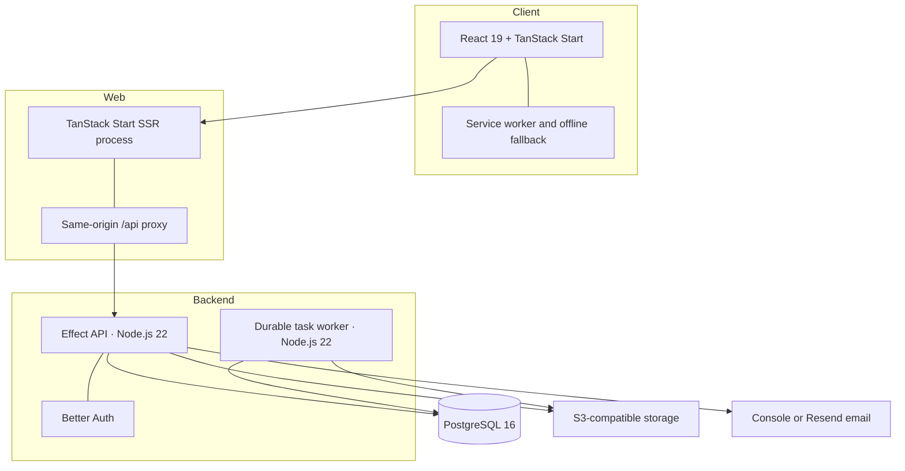
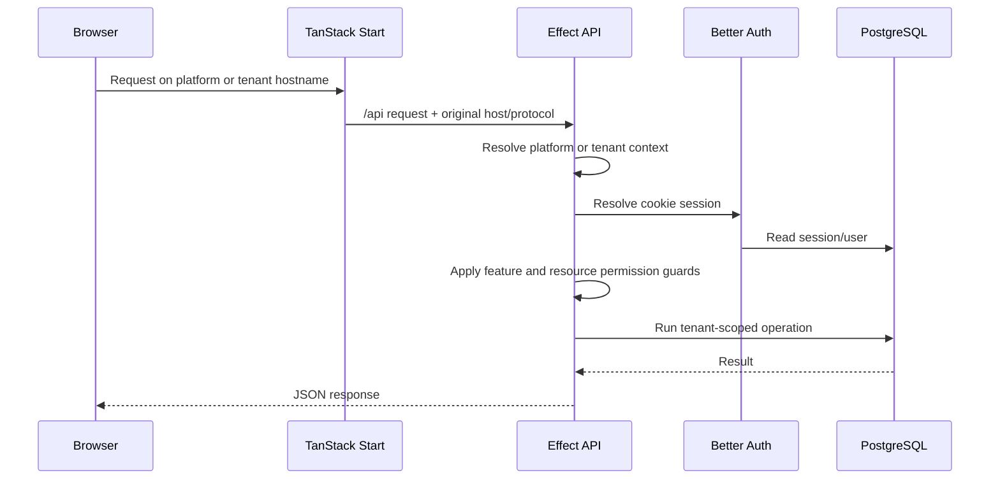
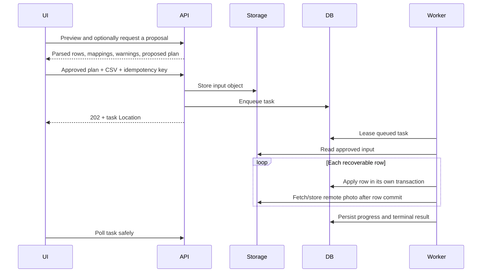
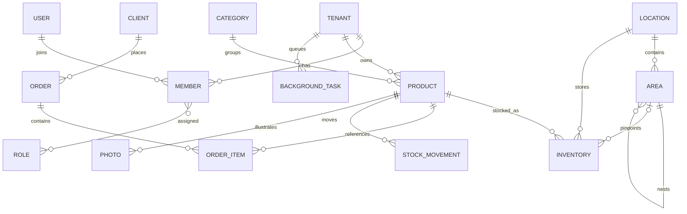

# Architecture

Stocket separates independently released repositories from a coordinated local
workspace. The application itself is a tenant-aware web/API system with a
durable background worker.

For the exhaustive repository and feature inventory, see the
[Project and Module Map](project-map.md).

## System Overview



The service worker precaches its fallback/manifest/brand assets, runtime-caches
fetched static assets, and shows the fallback when navigation is offline.
Successful application HTML and business data remain network-backed. There is
no offline database or conflict-resolving synchronization layer.

## Technology Stack

| Layer | Technology |
|-------|------------|
| Web | TanStack Start, React 19, TanStack Router, TanStack Query/Form, Vite, Tailwind CSS 4, StyleX, Base UI/Radix |
| API and worker | Effect, `@effect/platform-node`, Node.js 22, esbuild |
| Persistence | PostgreSQL 16 and Drizzle ORM |
| Authentication | Better Auth with cookie sessions |
| Object storage | AWS S3 client against MinIO locally and an S3-compatible provider in hosted environments |
| Email | Localized `@stocketfr/emails` templates with console or Resend transport |
| Contracts | Versioned `@stocketfr/types` package, consumed through the `@stocket/types` alias |
| Tooling | pnpm 10, TypeScript, Oxlint, Prettier, Vitest, Playwright, Nix flakes |
| Documentation | MkDocs Material with English/French suffix-based localization |

## Repository and Release Boundaries

The repositories can be cloned independently. `meta/repos.yaml` describes the
checkout assembled by `meta/scripts/bootstrap`; `meta/root/` supplies the root
pnpm workspace files used in that checkout.

This distinction matters:

- root filters are convenient for coordinated local checks;
- each repository retains its own Git history, CI, and lock/release policy;
- backend and frontend consume published shared packages, not mutable sibling
  source;
- infrastructure is operated separately and is not in `meta/repos.yaml`;
- backend/frontend application delivery is operator-controlled; there is no
  persistent automatic post-merge deploy or standalone rollback workflow.

See [Development Setup](setup.md) for the supported bootstrap flow and
[CI/CD](ci-cd.md) for current lifecycle details.

## Request and Tenant Flow



`PLATFORM_HOST` identifies the platform administration host.
`TENANT_BASE_DOMAIN` defines tenant subdomains. The web process forwards the
original host and protocol only through its trusted same-origin proxy path;
the API rejects unknown hosts before tenant data access.

## Backend Layering

The two backend entrypoints are `src/effect/main.ts` and
`src/effect/task-worker.ts`. Both compose explicit Effect layers from
`src/effect/application/layers.ts`.

```text
HTTP router
  → tenant/session/feature/permission guard
  → request decoding
  → module service
  → repository or external adapter
  → typed error mapping and response
```

Most business modules contain some combination of:

```text
modules/<feature>/
├── router.ts          # HTTP boundary, when the module is routable
├── service.ts         # application/domain operations
├── repository.ts      # Drizzle access
├── mappers.ts         # database-to-contract mapping
├── write.ts           # mutation coordination, when useful
├── types.ts           # internal types
└── *.errors.ts        # tagged domain/infrastructure failures
```

Request and response schemas generally live in `@stocketfr/types`; backend
modules may keep internal schemas close to the implementation.

Cross-cutting code is grouped by concern under `src/effect/platform/`:

- `auth/` — session, permissions, and Better Auth adapter;
- `db/` — Drizzle, committed SQL migrations, tenant helpers, transactions;
- `http/` — tenant route wrappers, decoding, search params, and errors;
- `observability/` — structured logging, localized catalogs, tracing;
- `tenancy/` — host validation, tenant context, and feature access;
- `storage.ts` — object-storage adapter.

Every non-production API start runs committed SQL, data-marker preparation,
Better Auth migration/repair, development-only hostname cleanup, then pending
superadmin data migrations. Production runs that sequence only when
`RUN_BETTER_AUTH_MIGRATIONS=true`. Default-role seeding and notification
scanning run on every API startup regardless of that migration gate.

## Durable Tasks and Product Imports

Large product imports are asynchronous:



PostgreSQL leases allow multiple workers to compete safely. Workers heartbeat,
recover expired leases, throttle progress writes, and retry according to the
environment configuration. A row failure is recorded in the partial result and
does not roll back already committed rows. Remote-photo work happens after its
row commit, so photo failure is also reported without undoing the product.
Terminal observers clean up stored input after the database result settles; an
object-storage lifecycle rule is still recommended as a crash fallback.

## Shared Contract Workflow

`packages/types` is not edited transitively from an application PR. A
cross-repository contract change normally follows this order:

1. change the package and add a Changeset;
2. publish/use the pull request's immutable snapshot for coordinated testing;
3. merge the package and its Changesets version PR;
4. update the stable version pinned by backend/frontend;
5. run consumer type checks and relevant cross-stack tests.

The package exposes domain subpaths such as `products`, `tasks`, `features`,
and `common`. Run `pnpm barrels` before `pnpm build` in `packages/types` when
adding files matched by the barrel generator.

## Authentication and Authorization

Better Auth owns account/session endpoints at `/api/auth`. Tenant API handlers
then apply three separate controls:

1. host-to-tenant resolution;
2. feature entitlement checks where applicable;
3. resource `READ`/`WRITE` permission checks.

Better Auth users are global accounts. A verified hostname selects a tenant,
then a membership connects that account to the tenant; one account can belong
to several tenants. Users may have multiple tenant roles and effective
permissions are their union. Feature entitlements are independent of RBAC: a
route can require both a resource permission and an enabled tenant feature.
Platform superadmins use `/platform` and `/api/v1/superadmin/*`; being a tenant
admin does not itself grant platform access.

## Domain Model



Important invariants include:

- products describe catalog items; inventory describes quantity and placement;
- an area belongs to one location and can nest within that location;
- inventory area paths are tenant- and permission-filtered;
- stock movements are ledger records; creating one does not mutate inventory,
  and inventory adjustment does not currently create a movement automatically;
- order transitions follow an explicit state machine;
- audit writes are best-effort background inserts and are not part of the
  business mutation transaction;
- tenant IDs scope business data and repository queries.

## API Documentation

The API is transitioning from hand-written `HttpRouter` modules to typed Effect
`HttpApiBuilder` groups. Swagger is served at `/docs`, but currently documents
only migrated groups (the health API). Do not treat it as a complete endpoint
catalog until all legacy routers have migrated.

## Deployment Model

The source supports local development and a separately managed hosted
topology. Backend and frontend CI does not automatically deploy after merge.
A temporary manual-only path was used for an audited July 2026 production
rollout, but it is not a persistent CD or standalone rollback surface. The
infrastructure repository operates the single-box runtime. Its deploy helper
can best-effort restore the previous image when its own Compose/readiness checks
fail after replacement begins; later workflow checks do not trigger that
recovery. See [CI/CD](ci-cd.md) for the exact boundary.
