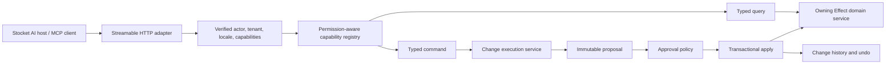

# AI and MCP Architecture

Stocket is adding a Model Context Protocol (MCP) application boundary so an AI
assistant can work with inventory data through the same domain rules as the web
application. The target is MCP `2025-11-25`, exposed to the first-party AI host
at `/api/v1/mcp`.

!!! warning "Current scope"
    The current endpoint is an authenticated, same-origin product prototype for
    the embedded Stocket application. It is not a public remote MCP server, and
    the durable change-set system required for safe bulk commands is not yet
    implemented. The sections below distinguish current behavior from the
    target architecture.

## Current Implementation

The first slice proves the Streamable HTTP transport, Effect integration,
request-scoped identity, typed schemas, and product service adapter. It exposes
these product tools:

| Tool | Current behavior | Confirmation and recovery |
|------|------------------|---------------------------|
| `products_list` | Search and page through products | Read-only |
| `products_get` | Read one active or archived product | Read-only |
| `products_create` | Create one product | Returns an instruction to archive it |
| `products_update` | Change selected fields on one product | Returns previous editable values; best-effort only |
| `products_archive` | Move one product to trash | Requires plain-language confirmation; can be restored |
| `products_restore` | Restore one product from trash | Can be archived again |

The normal Better Auth and tenant middleware authenticates every request. An
MCP session is bound to the verified user, tenant, destination, and origin that
created it, and permissions are checked again for every tool call. User and
tenant identifiers are never accepted as model-controlled tool arguments.

Sessions currently live in API process memory and expire after 30 minutes of
inactivity. Production horizontal scaling therefore needs sticky routing for
the complete session transport, or a redesigned shared/stateless transport.

The inverse instructions returned today are convenient UI hints, not a durable
undo guarantee. They can be lost with the conversation and an update reversal
could overwrite newer work. Bulk rename, move, archive, import, and other
high-impact commands must wait for the transactional change-set system.

## Design Principles

- MCP is an adapter over the owning Effect domain services. It is not generated
  from HTTP routes and does not call feature repositories directly.
- Expose narrow, semantic queries and commands rather than generic CRUD, SQL,
  arbitrary status changes, or raw task execution.
- Decode external input once with Effect Schema and return concise structured
  output containing stable identifiers and versions.
- Keep tenant fencing, permissions, feature checks, transactions, idempotency,
  and domain invariants in application services where every interface can
  reuse them.
- Treat MCP annotations as model and UI hints. The server still enforces every
  authorization and safety rule.
- Never expose permanent deletion, secrets, session tokens, raw database
  access, or platform-superadmin controls to the tenant assistant.

## Protocol Architecture



The MCP module owns protocol lifecycle, transport, capability negotiation,
schema codecs, filtered registration, elicitation, and protocol-safe error
rendering. Domain modules own business correctness, persistence, transactions,
and compensation. The change-set service is an application capability shared
with normal UI actions, not MCP-only rollback code.

The current adapter keeps `@effect/ai` Tool, Toolkit, Schema, and Effect runtime
as the application model while using the official TypeScript MCP SDK for the
newer protocol transport and security controls. This bridge can be revisited
when the installed native Effect transport provides equivalent behavior.

## MCP Capability Model

| Primitive | Interaction owner | Stocket use |
|-----------|-------------------|-------------|
| Tools | Model-controlled | Searches, calculations, and named domain commands |
| Resources | Application-controlled | Stable entity, proposal, change-set, and operation snapshots |
| Prompts | User-controlled | Optional user-selected workflows |
| Elicitation | Server-requested UI | Plain-language approval and secure integration setup |
| Tasks | Requestor-controlled, experimental | Optional view over Stocket durable operations |
| Progress | Request-scoped | Bounded feedback for validation, imports, and bulk work |

Application operations remain the source of truth for resumable work. MCP
Tasks may later adapt those operations for compatible clients, but they are not
an execution queue, history store, or undo ledger.

## Typed Capability Definitions

Each capability should have one reusable definition that derives its Effect
input and output schemas, MCP descriptor, annotations, access policy, safety
policy, handler, and conformance tests. Feature registries then compose into
the server registry.

```ts
const updateProduct = defineMcpCommand({
  name: "products_update",
  input: UpdateProductInput,
  output: ProductCommandResult,
  access: productWriteAccess,
  safety: reversibleWrite,
  execute: ({ input }) => ProductsService.update(input),
})

const productsMcp = defineMcpFeature({
  domain: "products",
  capabilities: [searchProducts, getProduct, updateProduct],
})
```

MCP schemas are JSON-native boundary contracts. HTTP query parsers and database
row shapes should not be reused when their wire representation is unsuitable.
Handlers call the owning service, while pure representation translation stays
in feature-local mappers.

## Naming, Discovery, and Toolkits

Tool names use `<plural_domain>_<intent>` in snake case, for example
`products_search`, `products_update_many`, `inventory_transfer`, and
`change_sets_undo`. Cardinality belongs in the name when it changes the contract
or safety policy. Breaking contracts receive a parallel version instead of an
in-place incompatible change.

`products_list` is the current prototype name and should become
`products_search` before external release. A generated contract manifest will
make accidental name and schema changes visible in CI.

The catalog is filtered by the authenticated actor, tenant permissions, enabled
features, remote scopes when applicable, selected toolkit, and readiness of the
underlying workflow:

| Toolkit | Intended surface |
|---------|------------------|
| Default | Workspace context, catalog data, read inventory, and change history |
| Operations | Inventory commands, orders, fulfillment, imports, and long-running operations |
| Administration | Tenant users, roles, and security workflows in a dedicated admin experience |
| Operator | Platform-superadmin operations on a separate server, if ever built |

Filtering improves model selection; it is not authorization. The server
reauthorizes every invocation and checks commands again immediately before a
write. A session or toolkit can narrow access but cannot grant new privileges.
The first-party AI host can progressively select relevant schemas for the
model, while the server keeps direct, typed tools instead of a generic
`call_tool` escape hatch.

## Confirmation and Durable Changes

Confirmation prevents an unintended action. Undo provides recovery after an
intended action has an unexpected result. High-impact workflows need both.

Every AI command that changes business state will use this lifecycle:

1. **Plan:** resolve a deterministic target set and persist an immutable,
   expiring proposal with its inputs, before/after data, versions, count, and
   hash.
2. **Authorize:** evaluate current tenant permissions, features, client scope,
   and operation-specific policy.
3. **Approve when required:** bind a one-time approval grant to the actor,
   tenant, proposal hash, client, and expiry. A model-provided
   `confirmed: true` value is never sufficient.
4. **Apply:** reauthorize and atomically consume the grant, verify row versions,
   apply domain writes in a transaction, and persist change items and their
   outcomes.
5. **Report:** return actual affected counts, conflicts, the durable change-set
   identifier, and the available recovery action.

Low-risk writes may pass from planning directly to apply when policy permits.
Destructive, sensitive, external, or bulk commands require explicit approval.
The confirmed target is never silently recomputed; a stale proposal expires or
returns a conflict so the user can review a new preview.

### User-Facing Approval

Nontechnical users should approve business effects, not tool calls or database
IDs. A confirmation must state:

- the action and affected object type in the user's language;
- the exact count, scope, filters, destination, and important exceptions;
- representative examples with expandable details for large sets;
- the visible result, atomicity or batching behavior, and external effects;
- whether the action can be undone, under what conditions, and for how long;
  and
- a specific affirmative label, such as **Move 84 products to Lyon**.

For the embedded application, MCP form elicitation can display simple prompts.
For remote or richer flows, acceptance must occur on an authenticated Stocket
page that issues the durable one-time grant. A remote client may automate or
misrepresent form elicitation, so elicitation alone is not trusted proof of
approval.

### Undo and Concurrency

Undo creates a new reversal change set; it never edits history or restores a
database backup. The reversal processes original items in dependency-safe order
and uses monotonic row versions with compare-and-swap checks. If newer human or
AI work changed an entity, the default is an atomic conflict rather than
overwriting that work.

Updates and moves restore captured previous values. Archives restore the prior
archive state. Reversing a create performs a compensating archive, not permanent
deletion, and identifiers such as an SKU can remain reserved. Some external
effects cannot be reversed; this must be disclosed before approval. Undo is
therefore available only when the operation defines a safe compensation, the
retention window is open, and the produced versions are still current.

The audit log, conversation state, MCP session, and MCP Task state are not
rollback storage. The transactional change-set and item records are the durable
source of truth.

## Domain Safety Gates

| Domain | Intended capabilities | Gate before writes are exposed |
|--------|-----------------------|--------------------------------|
| Products and catalog | Search, create, edit, archive, restore, and bulk organization | Durable versioned change sets before bulk mutation; no permanent delete |
| Inventory | Receive, adjust, count, reserve, release, and transfer stock | One atomic stock operation must update positions and movement history together |
| Orders | Read and execute named fulfillment transitions | State-specific validation, compensation, and compare-and-swap transitions; no arbitrary status setter |
| Imports | Preview, validate, map, and apply large data sets | Persisted operation, explicit batching/atomicity contract, checkpoints, and change-set linkage |
| External enrichment | Find addresses, suppliers, or catalog data | Open-world preview with provenance, followed by a closed-world reviewed patch |
| Tenant administration | Roles, invitations, sessions, and security workflows | Dedicated admin toolkit and tenant-safe service boundaries |
| Platform operations | Cross-tenant and superadmin workflows | Excluded from the tenant server; separate operator boundary if ever built |

Current inventory mutations and movement-history creation are separate paths,
so neither is safe to expose directly. A `StockOperations` workflow and database
position/version constraints must make them one transaction first. Orders
similarly expose named commands such as hold, resume, cancel, pack, and ship only
after each transition's invariants and recovery behavior exist.

External information never writes directly into Stocket. The assistant first
returns candidates with source, time, and confidence, then proposes a normal
typed patch for review. Provider secrets and OAuth setup use secure URL
elicitation, and the MCP bearer token is never forwarded to an external
provider.

## Identity, Tenancy, and Remote Access

The embedded endpoint relies on the application's verified request actor,
tenant middleware, same-origin checks, and user/tenant-bound sessions. Tool
inputs cannot choose the workspace or impersonate another user. Authorization
is evaluated at discovery, invocation, worker start, and before any resumed
write checkpoint.

Arbitrary remote clients are future work. A public endpoint requires OAuth
protected-resource metadata, OAuth 2.1 with PKCE, resource indicators and
audience validation, scoped grants, client registration policy, token
revocation, rate limits, and abuse monitoring. Until that work and a security
review are complete, `/api/v1/mcp` must remain a first-party application
endpoint.

## Resources and Long-Running Operations

Stable resources will give clients linkable snapshots such as
`stocket://workspace/context`, product and location records, inventory
positions, orders, change sets, and operations. Reads remain available as tools
for tool-centric clients; resources are the canonical links for entity and
workflow details.

Large imports or operations may run in persisted batches. Their preview and
result must disclose weaker atomicity when one transaction is impractical.
Workers reconstruct the trusted actor and reauthorize before work and every
write checkpoint. Optional MCP Tasks and progress can represent this lifecycle
without replacing the application operation or its retention policy.

## Delivery Sequence

1. Consolidate the current product slice behind typed query and command
   factories, a permission-aware registry, and a generated contract manifest.
2. Rename `products_list` to `products_search`, add cursor contracts, and keep
   existing single-product behavior covered by conformance tests.
3. Implement versioned, transactional change sets, immutable proposals,
   one-time approval grants, and reversal change sets.
4. Migrate product writes to the durable pipeline, then enable reviewed bulk
   product commands.
5. Add safe read surfaces for categories, locations, areas, suppliers, clients,
   inventory, orders, activity, and operations.
6. Build atomic stock operations, named order transitions, durable imports, and
   two-stage external enrichment before exposing their commands.
7. Add resources, subscriptions, and optional MCP Tasks only when their complete
   lifecycle is implemented.
8. Add OAuth scopes and remote-client hardening before publishing a remote MCP
   integration.

## Testing Expectations

- Registry tests enforce unique names, schema stability, explicit annotations,
  permission metadata, and toolkit membership.
- Adapter tests cover decoding, output validation, error sanitization,
  invocation scope, confirmation failure, and unsupported client capabilities.
- Every feature passes a shared conformance suite for tenant isolation,
  authorization, idempotency, stale versions, and structured output.
- Change-set integration tests use a real database to prove atomic apply,
  retries, approval consumption, concurrent conflicts, and reversal behavior.
- Model-selection evaluations verify that users' plain-language requests select
  the intended narrow tool and do not bypass confirmation.

See [Architecture](architecture.md), [API Development](api-development.md), and
[Testing](testing.md) for the wider platform conventions.

## Protocol References

- [MCP tools](https://modelcontextprotocol.io/specification/2025-11-25/server/tools)
- [MCP resources](https://modelcontextprotocol.io/specification/2025-11-25/server/resources)
- [MCP elicitation](https://modelcontextprotocol.io/specification/2025-11-25/client/elicitation)
- [MCP Tasks](https://modelcontextprotocol.io/specification/2025-11-25/basic/utilities/tasks)
- [MCP authorization](https://modelcontextprotocol.io/specification/2025-11-25/basic/authorization)
- [Streamable HTTP transport](https://modelcontextprotocol.io/specification/2025-11-25/basic/transports)
