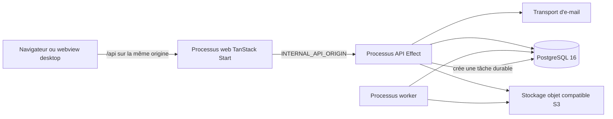

# Carte des projets et modules

Cette page est la carte de référence de la base de code Stocket. Stocket est un
**projet fédéré en plusieurs dépôts** : chaque dépôt possède son historique, sa
CI, son lockfile et son cycle de publication. Le dépôt `meta` peut réunir ces
dépôts dans un workspace pnpm local pour le développement coordonné.

## Carte des dépôts

| Dépôt | Responsabilité | Utilisation |
|-------|----------------|-------------|
| [`meta`](https://github.com/stocketfr/meta) | Manifeste du workspace, orchestration du bootstrap et du développement, fichiers pnpm racine, services Compose PostgreSQL et MinIO | À cloner en premier pour obtenir le checkout complet. `repos.yaml` est le manifeste des dépôts gérés. |
| [`backend`](https://github.com/stocketfr/backend) | API Effect sous Node.js 22, Better Auth, PostgreSQL, stockage objet, e-mails et workers | Exécute l'API HTTP et un processus worker séparé. Consomme des versions publiées de `@stocketfr/*`. |
| [`frontend`](https://github.com/stocketfr/frontend) | Application React 19 et TanStack Start | S'exécute en SSR en développement ou en mode hébergé. Le navigateur utilise `/api` sur la même origine ; le serveur relaie vers `INTERNAL_API_ORIGIN`. |
| [`packages`](https://github.com/stocketfr/packages) | Contrats API, modèles d'e-mail, configuration TypeScript et configuration de lint partagés | Publie des versions immuables sur GitHub Packages avec Changesets. Le backend et le frontend épinglent les versions publiées. |
| [`remote-desktop`](https://github.com/stocketfr/remote-desktop) | Shell desktop Tauri 2 expérimental | Le code actuel fournit un écran mémorisant l'URL du serveur. Le workflow vise à embarquer un build frontend, mais contient des hypothèses de dépôt/build obsolètes et doit être réparé et vérifié avant une release. Ce n'est pas un moteur de synchronisation hors ligne. |
| [`documentation`](https://github.com/stocketfr/documentation) | Ce site MkDocs bilingue | Les pull requests auditent locales/navigation/liens et exécutent un build MkDocs strict ; `main` répète l'audit puis déploie vers GitHub Pages. |
| [`landing`](https://github.com/stocketfr/landing) | Site marketing statique et domaine personnalisé | Déployé indépendamment avec GitHub Pages. Ce n'est pas un runtime applicatif. |
| [`infrastructure`](https://github.com/stocketfr/infrastructure) | Automatisation Hetzner, Cloudflare, Terraform, Ansible, Caddy, Postgres, sauvegardes R2 et Datadog | Exploité séparément de `meta`. Il gère la topologie hébergée sur un serveur et le helper de déploiement, mais aucun CD backend/frontend automatique et persistant après merge. |

!!! note "Workspace local et frontières des dépôts"
    Le bootstrap lie les fichiers racine depuis `meta/root/` et exécute pnpm
    sur le checkout. Cette commodité ne transforme pas les projets en une
    unité de publication. Modifiez et publiez dans le dépôt propriétaire.

Le workspace racine contient une entrée réservée `mobile-app`, mais
`meta/repos.yaml` ne gère ni ne clone actuellement d'application mobile. Elle
ne doit pas être présentée comme un projet actif tant qu'elle n'est pas ajoutée
au manifeste.

## Topologie d'exécution

L'API et le worker sont deux processus Node.js distincts construits depuis le
même dépôt backend. Les imports de produits sont mis en file dans PostgreSQL,
loués par un worker et utilisent un stockage compatible S3 pour le fichier
d'entrée et les photos. Au moins un worker doit être actif lorsque les imports
en arrière-plan sont disponibles.

Stocket est multi-tenant. L'hôte plateforme sert aux opérations superadmin ;
les hôtes tenant sélectionnent une organisation et limitent les données. En
développement local, `localhost:3000` est l'hôte plateforme et les tenants
utilisent `<slug>.localhost:3000`.

## Modules backend

Les modules de production résident dans `backend/src/effect/modules/`. La
plupart suivent router → service → repository, avec les préoccupations
partagées fournies par des layers Effect.

| Module | Responsabilité et surface |
|--------|---------------------------|
| `areas` | Étagères, bacs et sous-emplacements hiérarchiques ; API tenant et détail d'un emplacement. |
| `audit-logs` | Métadonnées partielles des mutations, écrites au mieux ; API tenant et UI admin. Les écritures sont asynchrones et hors transaction. |
| `auth` | Utilisateur courant, profil et claims de session autour de Better Auth, monté sous `/api/auth`. |
| `branding` | Lecture publique et mise à jour protégée de la marque ; écran Paramètres. |
| `categories` | Catégories hiérarchiques utilisées par Produits et le planificateur d'import. |
| `clients` | Clients utilisés par la création et le filtrage des commandes. |
| `features` | Plans, droits et overrides tenant pour `smartImport` et `orders`. |
| `fulfillment` | Prototype de domaine non monté pour confirmation et picking. Il n'est relié ni au layer applicatif ni au router HTTP ; packing et expédition renvoient explicitement « non implémenté ». |
| `health` | Endpoints publics de liveness, readiness et santé complète ; premier module migré vers Effect `HttpApiBuilder`. |
| `inventory` | Quantités, lots, dates d'expiration, requêtes de stock faible/expiration et chemins complets des zones. |
| `locations` | Entrepôts, fournisseurs, clients et emplacements en transit. |
| `notifications` | API de préférences e-mail et scan planifié. Seul le stock faible émet actuellement un événement ; le cycle des commandes n'est pas livré et aucune page frontend dédiée n'existe. |
| `orders` | CRUD, lignes à la création puis en lecture seule, donnée d'affectation et transitions. Aucune route ne modifie ensuite les lignes et fulfillment n'est pas monté. |
| `photos` | Upload, lecture et suppression des photos produit via stockage compatible S3. |
| `platform` | Endpoint opérationnel public utilisé par le TLS à la demande de Caddy pour autoriser les domaines plateforme et tenant. |
| `products` | Catalogue, actions groupées, suppression/restauration, preview CSV, propositions et import guidé durable. |
| `roles` | Rôles système/personnalisés et permissions lecture/écriture par ressource. |
| `stock-movements` | Registre immuable des mouvements. Créer un mouvement ne modifie pas l'inventaire et les ajustements n'en émettent pas actuellement. |
| `superadmin` | Identité plateforme, création/import/suppression de tenants, plans, overrides et audit plateforme séparé. La suppression ne nettoie pas actuellement tout le préfixe S3 ni tous les artefacts globaux/auth. |
| `suppliers` | Contacts fournisseurs et références depuis les produits. |
| `tasks` | État, progression, annulation, lease, reprise et registre des workers. L'import produit est le type de tâche actuel. |
| `users` | Création d'utilisateur/appartenance et rôles. Ban/révocation agissent globalement sur tous les tenants ; supprimer retire cette appartenance et le compte seulement après la dernière. |

`e2e` est un router de support toujours désactivé en production. Dans les autres
environnements, un secret E2E configuré le protège ; en développement sans
secret configuré, la route locale de seed est permise. Ce n'est pas un module
métier.
La route authentifiée `/api/v1/_migration` est un diagnostic interne du runtime
et des modules, pas une fonctionnalité produit.

### Couches plateforme et application

| Zone | Responsabilité |
|------|----------------|
| `src/effect/application/` | Validation de l'environnement, composition des layers, migrations de démarrage et câblage API/worker. |
| `src/effect/http/` | Composition des routers, résolution tenant, CORS, sécurité, logs de requête et erreurs. |
| `src/effect/platform/auth/` | Sessions, permissions, adaptateur Better Auth et gardes d'autorisation. |
| `src/effect/platform/db/` | Drizzle, helpers tenant, migrations SQL commitées et migrations de données. |
| `src/effect/platform/observability/` | Logs structurés localisés, tracing et service tracer. |
| `src/effect/platform/tenancy/` | Hôtes, contexte tenant, requêtes tenant et droits fonctionnels. |
| `src/effect/platform/storage.ts` | Adaptateur de stockage compatible S3. |
| `src/email/` | Transports console, mémoire et Resend. |
| `src/scripts/` | Administration superadmin/tenant, données de démo et import. |

## Modules frontend

Les routes authentifiées résident sous `src/routes/_authed/` et sont protégées
par la session et les permissions de ressource.

| Route | Module utilisateur |
|-------|--------------------|
| `/` | Totaux du tableau de bord, stock faible et activité récente. |
| `/products` et `/products/:id` | Recherche/pagination, actions groupées, import CSV guidé, détail, édition et photos. Les catégories sont gérées ici. |
| `/locations` et `/locations/:id` | Recherche/filtrage, détail et zones hiérarchiques. |
| `/inventory` | Inventaire avec filtres emplacement/zone, stock faible, lot et expiration. |
| `/clients` | Recherche, filtre de statut et CRUD des clients. |
| `/suppliers` | Recherche par nom, filtre actif/inactif et CRUD des contacts. L'état actif se modifie dans le formulaire. |
| `/orders` | Recherche/statuts, lignes à la création, modifications limitées des Brouillons/Confirmées et transitions. Le prototype `fulfillment` non monté n'est pas un workflow UI actif. |
| `/stock-movements` | Historique et filtres motif/produit/emplacement, mouvements manuels. |
| `/audit-logs` | Filtres action/entité et métadonnées de mutation, sans détail avant/après. |
| `/users` | Cycle de vie des utilisateurs et affectation des rôles. |
| `/roles` | Gestion des rôles et permissions. |
| `/settings` | Marque, apparence, langue et déconnexion. |
| `/platform` | Administration des tenants, plans, overrides et imports, uniquement sur l'hôte plateforme. |

Les routes publiques couvrent la connexion, l'inscription, le mot de passe
oublié, sa réinitialisation et les erreurs. Les dossiers de
`src/components/` reflètent les fonctionnalités ; les accès API et clés de
cache résident dans `src/lib/data/`.

## Packages partagés

| Package | Contenu |
|---------|---------|
| `@stocketfr/types` | Schémas Effect, DTO, IDs, enums, pagination, droits, tâches et contrats de tous les domaines publics. Les consommateurs utilisent des sous-chemins comme `@stocket/types/products`. |
| `@stocketfr/emails` | Modèles React Email localisés pour vérification, mot de passe, bienvenue et stock faible. |
| `@stocketfr/tsconfig` | Configuration TypeScript stricte partagée. |
| `@stocketfr/eslint-config` | Configuration de lint publiée ; le backend et le frontend exécutent actuellement Oxlint directement. |

Les changements de packages utilisent Changesets. Les pull requests peuvent
publier des snapshots immuables pour les tests inter-dépôts ; la fusion de la
PR de version Changesets publie les versions stables sur GitHub Packages. Le
backend et le frontend mettent ensuite à jour leurs alias épinglés.

## État des déploiements

- Le backend et le frontend exécutent la CI sur les pushes et pull requests,
  sans déploiement automatique persistant après merge ni workflow autonome de
  rollback.
- Des workflows manuels temporaires ont servi à un rollout audité en juillet
  2026. Tant qu'ils étaient présents, ils n'acceptaient que le `main` courant
  avec une CI push réussie, publiaient des images taguées par SHA et appelaient
  le helper infrastructure ; tous deux ont été retirés après ce rollout unique.
- La documentation reste déployée automatiquement sur GitHub Pages depuis
  `main`.
- Les packages restent publiés via Changesets et GitHub Packages.
- Le site marketing est un projet GitHub Pages indépendant.
- L'infrastructure provisionne et configure la topologie hébergée. Son helper
  tente de restaurer l'image précédente uniquement si ses propres contrôles
  Compose/readiness échouent après le début du remplacement. Les contrôles
  ultérieurs du workflow ne déclenchent pas cette récupération, qui n'est ni un
  CD persistant ni un workflow de rollback déclenché par l'opérateur.
- Le workflow desktop vise à créer des releases natives en brouillon, mais ses
  noms de dépôts, flags de build frontend et chemins de sortie sont obsolètes.
  Ce chemin reste non vérifié jusqu'à sa correction. Un build desktop
  n'implique ni base de données hors ligne ni synchronisation avec résolution
  de conflits.

Lorsque ces choix changent, mettez à jour ensemble cette page, le guide
[CI/CD](ci-cd.md) et la [feuille de route](../roadmap.md).
