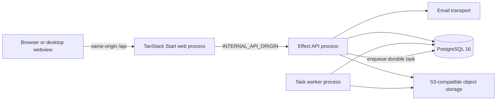

# Project and Module Map

This page is the source-of-truth map for the Stocket codebase. Stocket is a
**federated multi-repository project**: each repository has its own history,
CI, lockfile, and release lifecycle. The `meta` repository can assemble those
repositories into one local pnpm workspace for coordinated development.

## Repository Map

| Repository | Responsibility | How it is used |
|------------|----------------|----------------|
| [`meta`](https://github.com/stocketfr/meta) | Workspace manifest, bootstrap/dev orchestration, root pnpm files, PostgreSQL and MinIO Compose services | Clone this first for a complete local checkout. `repos.yaml` is the managed-repository manifest. |
| [`backend`](https://github.com/stocketfr/backend) | Node.js 22 Effect API, Better Auth, PostgreSQL persistence, object storage, email, and background workers | Runs the HTTP API and a separate task-worker process. Consumes versioned `@stocketfr/*` packages. |
| [`frontend`](https://github.com/stocketfr/frontend) | React 19 and TanStack Start application | Runs as an SSR web process in development/hosted mode. Browser API calls use same-origin `/api`; the server proxies to `INTERNAL_API_ORIGIN`. |
| [`packages`](https://github.com/stocketfr/packages) | Shared API contracts, email templates, TypeScript config, and lint config | Publishes immutable versions to GitHub Packages with Changesets. Backend and frontend pin released versions. |
| [`remote-desktop`](https://github.com/stocketfr/remote-desktop) | Experimental Tauri 2 desktop shell | Current source provides a saved server-URL connection screen. Its release workflow intends to bundle a frontend build, but currently contains stale repository/build assumptions and must be repaired and verified before release. This is not an offline data-sync engine. |
| [`documentation`](https://github.com/stocketfr/documentation) | This bilingual MkDocs site | Pull requests audit locale/navigation/link consistency and run a strict MkDocs build; `main` repeats the audit and deploys to GitHub Pages. |
| [`landing`](https://github.com/stocketfr/landing) | Static marketing site and custom domain | Deployed independently through GitHub Pages. It is not an application runtime. |
| [`infrastructure`](https://github.com/stocketfr/infrastructure) | Hetzner, Cloudflare, Terraform, Ansible, Caddy, Postgres, R2 backups, and Datadog automation | Operated separately from `meta`. It runs the single-box hosted topology and deploy helper, but backend/frontend have no persistent automatic post-merge CD. |

!!! note "Local workspace versus repository boundaries"
    Bootstrap links the root workspace files from `meta/root/` and runs pnpm
    across the checkout. That convenience does not turn the projects into one
    release unit. Make and publish changes in the repository that owns them.

The root workspace file contains a reserved `mobile-app` entry, but
`meta/repos.yaml` does not currently manage or clone a mobile application. Do
not treat it as an active project until it is added to the manifest.

## Runtime Topology

The API and task worker are separate Node.js processes built from the same
backend repository. Product imports are queued in PostgreSQL, leased by a
worker, and use S3-compatible storage for uploaded input and product photos.
Run at least one worker anywhere background imports are enabled.

Stocket is tenant-aware. The platform host is used for superadmin operations;
tenant hosts select an organization and scope data access. In local
development, `localhost:3000` is the platform host and tenant URLs use
`<slug>.localhost:3000`.

## Backend Modules

Production modules live under `backend/src/effect/modules/`. Most HTTP modules
follow router → service → repository, with shared concerns supplied by Effect
layers.

| Module | Responsibility and surface |
|--------|----------------------------|
| `areas` | Hierarchical shelves, bins, and other sub-locations; tenant API and location-detail UI. |
| `audit-logs` | Partial, best-effort mutation metadata with tenant API and admin UI. Writes are asynchronous and not transactional. |
| `auth` | Current-user/profile/session claims around Better Auth. Better Auth itself is mounted at `/api/auth`. |
| `branding` | Public branding reads and permission-gated updates; Settings UI. |
| `categories` | Hierarchical product categories used in the Products UI and import planner. |
| `clients` | Client records used by order creation and filtering. |
| `features` | Tenant plans, entitlements, and overrides for `smartImport` and `orders`; exposed through platform/superadmin operations and frontend feature gates. |
| `fulfillment` | Unmounted domain prototype for confirmation and picking. It is not wired into the application layer or HTTP router; packing and shipping explicitly return not-implemented failures. |
| `health` | Public liveness, readiness, and full health endpoints; the first module migrated to Effect `HttpApiBuilder`. |
| `inventory` | Quantities, batches, expiry dates, low-stock/expiry queries, and full area paths. |
| `locations` | Warehouse, supplier, client, and in-transit locations. |
| `notifications` | User email-preference API and scheduled scanning. Low-stock email is the only emitted event today; order-lifecycle delivery is not implemented and no dedicated frontend page exists. |
| `orders` | Order CRUD, create-time/read-only line items, assignment data, and status transitions. There is no later line-item mutation route, and it does not mount fulfillment. |
| `photos` | Product photo upload/read/delete backed by S3-compatible storage. |
| `platform` | Public operational endpoint used by Caddy on-demand TLS to authorize platform and tenant domains. |
| `products` | Product catalog, bulk actions, soft-delete/restore, CSV preview/proposals, and durable guided import execution. |
| `roles` | Custom/system roles and resource-level read/write permissions. |
| `stock-movements` | Immutable movement ledger records. Creating a movement does not change inventory, and inventory adjustments do not currently emit movements. |
| `superadmin` | Platform identity, tenant creation/import/deletion, plan selection, feature overrides, and separate platform audit. Tenant deletion does not currently clean the full S3 prefix or every global/auth artifact. |
| `suppliers` | Supplier contact records and product references. |
| `tasks` | Durable task state, progress, cancellation, leasing, recovery, and worker registry. Product import is the current registered task type. |
| `users` | Tenant user/membership creation and roles. Ban/unban and session revocation affect the global account across memberships; delete removes this membership and deletes the account only after its last membership. |

`e2e` is a test-support router and is always disabled in production. In other
environments, a configured E2E seed secret protects it; development without a
configured secret permits the local seed route. It is not a business module.
The authenticated `/api/v1/_migration` route is an internal runtime/module
diagnostic, not a product feature.

### Backend Platform and Application Layers

| Area | Responsibility |
|------|----------------|
| `src/effect/application/` | Environment validation, layer composition, startup migrations, and API/worker entrypoint wiring. |
| `src/effect/http/` | Router composition, tenant resolution, CORS, security headers, request logging, and error responses. |
| `src/effect/platform/auth/` | Session resolution, permission provider, Better Auth adapter, and authorization guards. |
| `src/effect/platform/db/` | Drizzle database, tenant-aware helpers, committed SQL migrations, and startup data migrations. |
| `src/effect/platform/observability/` | Localized structured logs, tracing, and the service tracer. |
| `src/effect/platform/tenancy/` | Host parsing, tenant context, tenant queries, and feature access. |
| `src/effect/platform/storage.ts` | S3-compatible storage adapter. |
| `src/email/` | Console, in-memory, and Resend transports. |
| `src/scripts/` | Superadmin/tenant administration, seed data, and import utilities. |

## Frontend Modules

Authenticated routes live below `src/routes/_authed/` and are protected by
session and resource-permission guards.

| Route | User-facing module |
|-------|--------------------|
| `/` | Dashboard totals, low-stock summary, and recent activity. |
| `/products` and `/products/:id` | Product search/pagination, bulk actions, guided CSV import, details, editing, and photos. Categories are managed in this surface. |
| `/locations` and `/locations/:id` | Location search/filtering, details, and hierarchical area management. |
| `/inventory` | Searchable inventory with location/area, low-stock, batch, and expiry filters. |
| `/clients` | Client search, status filters, and CRUD. |
| `/suppliers` | Supplier-name search, active-state filter, and contact CRUD. Active state changes through edit. |
| `/orders` | Order search/status filters, create-time line items, limited Draft/Confirmed edits, and status transitions. The unmounted `fulfillment` prototype is not a live UI workflow. |
| `/stock-movements` | Movement history, reason/product/location filters, and manual movements. |
| `/audit-logs` | Action/entity filters and mutation metadata. No before/after detail is displayed. |
| `/users` | User lifecycle and role assignments. |
| `/roles` | Role and permission management. |
| `/settings` | Branding, appearance, language, and account sign-out. |
| `/platform` | Platform-host-only tenant, plan, feature-override, and tenant-import administration. |

Public routes cover login, signup, forgotten passwords, password reset, and
not-found/error handling. Frontend feature folders mirror these routes under
`src/components/`; API access and cache keys live in `src/lib/data/`.

## Shared Packages

| Package | Contents |
|---------|----------|
| `@stocketfr/types` | Effect schemas, DTOs, entity IDs, enums, pagination helpers, feature entitlements, tasks, and contracts for every public domain. Consumers import through subpaths such as `@stocket/types/products`. |
| `@stocketfr/emails` | Localized React Email templates for verification, password reset, welcome, and low-stock messages. |
| `@stocketfr/tsconfig` | Shared strict TypeScript base configuration. |
| `@stocketfr/eslint-config` | Published shared lint configuration; backend and frontend currently execute Oxlint directly. |

Shared-package changes use Changesets. Pull requests can publish immutable
snapshot versions for cross-repository testing; merging the Changesets version
PR publishes stable GitHub Packages releases. Backend and frontend then update
their pinned package aliases.

## Deployment Status

- Backend and frontend run CI on pushes and pull requests, with no persistent
  automatic post-merge deploy or standalone rollback workflow.
- Temporary manual-only workflows were used for an audited July 2026 rollout.
  While present, they accepted only current `main` with successful push CI,
  published SHA-tagged images, and invoked the infrastructure deploy helper;
  both were removed after that one-time rollout.
- Documentation still deploys automatically to GitHub Pages from `main`.
- Packages still publish through Changesets and GitHub Packages.
- The landing site is an independent GitHub Pages project.
- Infrastructure provisions and configures the hosted topology. Its deploy
  helper best-effort restores the prior image only when helper-owned
  Compose/readiness checks fail after replacement begins. Later workflow checks
  do not trigger that recovery, which is not a persistent CD or
  operator-triggered rollback workflow.
- The desktop workflow is intended to create draft native releases, but its
  repository names, frontend build flags, and output paths are currently stale.
  Treat that path as unverified until it is repaired. A desktop build does not
  imply offline database operation or conflict-resolving sync.

When these lifecycle decisions change, update this page, the
[CI/CD guide](ci-cd.md), and the [roadmap](../roadmap.md) together.
