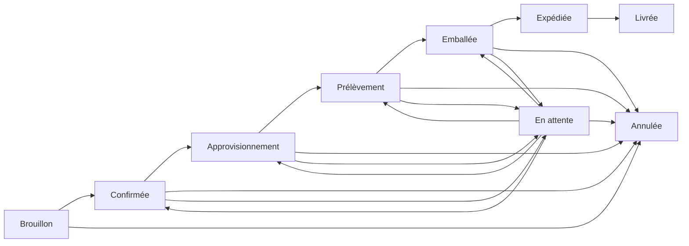

# Commandes

Les commandes suivent les produits demandés par un client et leur livraison. **Opérations → Commandes** (`/orders`) exige la fonctionnalité tenant `ORDERS` et la permission correspondante.

## Parcourir

Recherchez numéro de commande ou société cliente et filtrez par statut. Le tableau affiche numéro, client, statut, nombre d'articles, total, création et actions. Il n'existe actuellement ni route de détail, kanban, assignation ou historique complet dans le frontend.

## Créer

Une commande commence toujours en **Brouillon**. Indiquez :

- un client ;
- l'adresse de livraison ;
- au moins un article avec produit, quantité positive, prix unitaire non négatif et notes facultatives ;
- éventuellement échéance, yacht et instructions.

Choisir un produit préremplit son prix standard si disponible. Choisir le client ne recopie ni son adresse ni son yacht. Il n'existe pas d'option « enregistrer confirmée ».

## Modifier et supprimer

Les commandes Brouillon et Confirmée peuvent modifier adresse, échéance, yacht et instructions. L'interface actuelle ne change ni client ni lignes. Seul un Brouillon peut être supprimé.

## Cycle des statuts

Les statuts décrivent uniquement le flux. Aucun endpoint de fulfillment monté ni contrôle explicite des quantités prélevées/emballées n'existe actuellement, et changer le statut ne réserve ni n'ajuste l'inventaire.

La lecture exige `ORDERS.READ`; création, modification, statut et suppression exigent `ORDERS.WRITE`.
