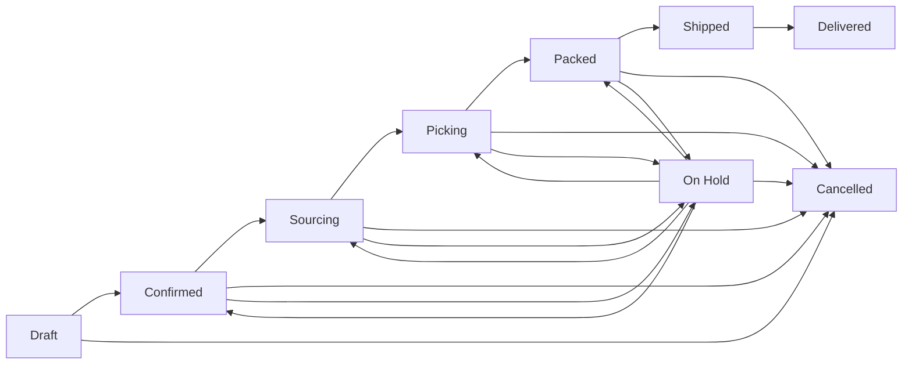

# Orders

Orders track a client's requested products and delivery workflow. **Operations → Orders** (`/orders`) requires both the tenant's `ORDERS` feature and the relevant permission.

## Browse

Search order number or client company and filter by status. The table shows order number, client, status, item count, total, creation time, and available actions. There is no separate detail route, kanban, assignee workflow, or full change history in the current frontend.

## Create

A new order always starts as **Draft**. Provide:

- a client;
- delivery address;
- at least one item with product, positive quantity, non-negative unit price, and optional notes;
- optional deadline, yacht name, and special instructions.

Selecting a product prefills its standard price when available. Selecting a client does not copy the client's default address or yacht. There is no “save as confirmed” option.

## Edit and delete

Draft and Confirmed orders can edit delivery address, deadline, yacht, and instructions. The current edit UI does not change the client or line items. Only Draft orders can be deleted.

## Status workflow

Status labels describe workflow only. The application does not currently provide mounted fulfillment endpoints or explicit picked/packed quantity controls, and status changes do not reserve or adjust inventory.

Viewing needs `ORDERS.READ`; creation, editing, status changes, and deletion need `ORDERS.WRITE`.
